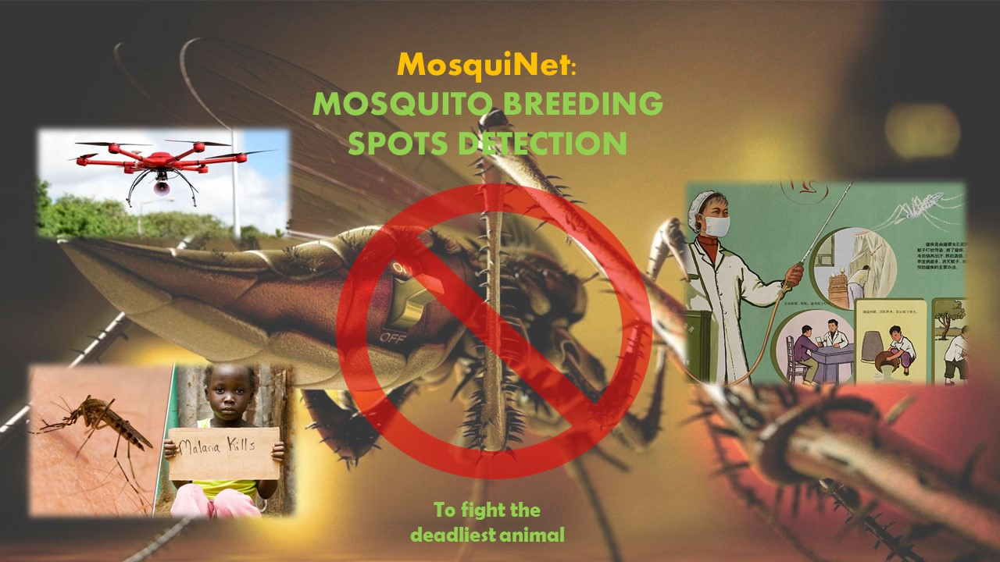

MosquiNet is an innovative project that allows users to easily detect any potential mosquito breeding grounds from any aerial videos. It is developed as a software solution that takes in an aerial video of an area as its input, stores the video in Azure Blob storage and utilizes the power of Azure Machine Learning to detect any potential mosquito breeding sites in the video and also highlights those areas in that video.

The user can upload any aerial video footage to the website to detect the breeding sites and then will be presented with the potential breeding sites marked as bounding boxes in the video.

This simple yet effective automated task will have a huge benefit as it can enable government authorities, NGOs, businesses and even individual users to take timely actions to control the spread of mosquitoes and related diseases. This can not only save and improve precious lives, but also help everyone fight the deadly menace of vector-borne diseases in a timely and efficient manner.

Thus, MosquiNet reiterates Microsoft’s vision to use the power of technology to empower people and make this world a better, healthier and happier place!

Try out the MosquiNet program at : http://mosquinetmshack.azurewebsites.net/
